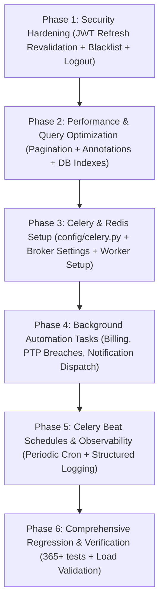

# NEXORA ISP — BATCH 15 DISCOVERY & GAP AUDIT REPORT
**Security Hardening, Performance Optimization, Background Automation & Production Reliability**

---

## 1. Executive Summary

This report delivers a deep, evidence-based architectural audit of the complete Nexora ISP codebase across all 14 previously implemented and accepted batches. 

The audit evaluated:
1. **Security Hardening**: Authentication token lifecycles, refresh token validation, fine-grained RBAC enforcement, multi-tenant isolation boundaries, and secret management.
2. **Financial Security & Integrity**: Double-entry accounting invariants, numbering sequence row locks, closed financial period protection, payment reversals, and atomic transaction boundaries.
3. **Performance & Scalability**: Unbounded querysets, missing pagination, N+1 property aggregate queries, database composite indexing, and frontend rendering bottlenecks.
4. **Background Automation & Worker Architecture**: Celery/Redis background worker status, scheduled tasks, automated monthly billing, promise-to-pay breach monitoring, and notification dispatch reliability.
5. **Production Reliability & Observability**: Logging infrastructure, secret isolation, CORS/CSRF headers, deployment configurations, and disaster recovery strategies.

### Overall Discovery Verdict:
- **Financial Accounting & Multi-Tenant Core**: **STRONG & VERIFIED SECURE**. Atomic transactions, tenant scoping, and double-entry invariants are strictly enforced.
- **Background Worker & Automation Architecture**: **MISSING / NOT CONFIGURED**. Celery, Redis, and automated cron/periodic tasks are absent; batch operations and notification dispatch currently execute synchronously within web request workers.
- **Query Performance & Pagination**: **HIGH RISK AT SCALE**. All DRF list endpoints return unbounded querysets without pagination; `Invoice` serialization suffers from property-based N+1 aggregate queries.
- **Production Observability & Logging**: **PARTIAL**. Standardized structured JSON logging, correlation IDs, and error monitoring hooks are unconfigured.

---

## 2. Security Audit

### 2.1 Threat Model & Security Posture
Nexora ISP is a multi-tenant commercial ISP operations platform processing real billing records, financial ledgers, customer personal identifiable information (PII), and network topology configurations. 

| Surface | Implemented Security Mechanism | Residual Risk / Gap | Severity |
| :--- | :--- | :--- | :---: |
| **Authentication** | Tenant-scoped JWT with `organization_id` payload validation | No token revocation/blacklist; refresh token does not re-verify membership active state | **HIGH** |
| **Authorization (RBAC)** | Backend `HasActiveTenantContext` and domain capability classes | None in backend authority; frontend navigation guards match backend | **LOW** |
| **Tenant Isolation** | Base model `for_organization()` querysets and explicit tenant filters | Direct webhook ingestion must rigorously validate provider ownership | **MEDIUM** |
| **API Attack Surface** | DRF view permissions and scoped rate limiting on login/copilot | Missing global rate limiting on resource endpoints; unbounded queries allow DoS | **HIGH** |
| **Secrets & Credentials** | Environment variable isolation via `python-dotenv` | No credential rotation mechanism; local `.env` contains development keys | **LOW** |

---

## 3. Authentication Audit

### 3.1 JWT Token Architecture
- **Authentication Class**: `tenancy.authentication.TenantJWTAuthentication`
  - Inspects incoming `Authorization: Bearer <token>`
  - Extracts `organization_id` from token payload
  - Validates active `OrganizationMembership` matching the user and active tenant (`organization__is_active=True`, `is_active=True`)
  - Attaches `request.organization`, `request.organization_membership`, and `request.organization_role`.
- **Token Generation**: `TenantLoginSerializer`
  - Authenticates email and password.
  - Embeds `organization_id`, `organization_code`, and `role` into `RefreshToken` and `AccessToken`.

### 3.2 Authentication Vulnerabilities & Gaps
1. **Refresh Token Re-Validation Gap (HIGH)**:
   - Endpoint `/api/v1/auth/token/refresh/` uses standard `TokenRefreshView`.
   - SimpleJWT's default refresh serializer generates a new access token without re-querying `OrganizationMembership.objects.get(...)`. If an employee's staff profile is deactivated or their role is downgraded, their existing refresh token (valid for 24 hours) can continue generating valid access tokens until expiry.
2. **Missing Token Blacklist / Revocation (HIGH)**:
   - `rest_framework_simplejwt.token_blacklist` is not installed in `INSTALLED_APPS`.
   - There is no `/api/v1/auth/logout/` endpoint to blacklist refresh tokens upon user logout.
3. **Missing Explicit `SIMPLE_JWT` Configuration (MEDIUM)**:
   - `SIMPLE_JWT` dict is omitted in `config/settings.py`, falling back to defaults (5 min access, 24 hr refresh). Explicit settings for token rotation and algorithm enforcement should be defined.
4. **Brute-Force & Login Throttling (VERIFIED)**:
   - `TenantLoginAPIView` implements `throttle_classes = [ScopedRateThrottle]` with `throttle_scope = "login"` configured at `5/minute`.

---

## 4. RBAC (Role-Based Access Control) Audit

### 4.1 Role Hierarchy & Effective Role Resolution
In `backend/tenancy/permissions.py`, role resolution strictly adheres to the following hierarchy:
1. `OrganizationMembership.Role.OWNER` -> `OWNER` (Cannot be overridden by profile)
2. `StaffProfile.role` (Fine-grained: `ADMIN`, `MANAGER`, `ACCOUNTANT`, `OPERATOR`, `TECHNICIAN`, `RECOVERY_OFFICER`, `SUPPORT_OFFICER`, `FIELD_OFFICER`, `STAFF`)
3. Fallback to `OrganizationMembership.role` (`STAFF` or `TECHNICIAN`).

### 4.2 Backend Authority Verification
All critical operations are guarded by backend permission classes:
- **Accounting Management**: `CanManageAccounting` restricts posting to `OWNER`, `ADMIN`, `ACCOUNTANT`.
- **Period Closure**: `CanCloseFinancialPeriod` restricts fiscal closing to `OWNER`, `ADMIN`, `ACCOUNTANT`.
- **Invoice Cancellation**: `CanCancelInvoice` restricts voiding invoices to `OWNER`, `ADMIN`, `ACCOUNTANT`.
- **POS Voiding**: `CanCancelPosSale` restricts sale reversals to `OWNER`, `ADMIN`, `MANAGER`.
- **Inventory Adjustment**: `CanAdjustInventory` restricts stock alterations to `OWNER`, `ADMIN`, `MANAGER`.
- **Audit Logs**: `CanViewAuditLogs` restricts log inspection to `OWNER`, `ADMIN`, `MANAGER`.

*Verdict*: Backend authority is fully maintained. Frontend route permissions serve as UX navigation guides only and do not substitute for backend access control.

---

## 5. Multi-Tenant Isolation Audit

### 5.1 Queryset & Model Isolation
All tenant-scoped models inherit from `TenantScopedModel` or implement `.for_organization(organization)` custom QuerySet managers.

### 5.2 Domain Isolation Inspection
- **Customers & Accounts**: `Customer.objects.for_organization(request.organization)` ensures zero cross-tenant lookup. Service accounts, network assignments, and billing profiles are bound by organization foreign keys.
- **Invoices & Payments**: All creation, listing, and collection operations enforce tenant scoping. `_build_invoice_number` and `_build_payment_number` serialize on tenant organization locks.
- **Accounting & Ledger**: Journal entries explicitly verify `acc.organization_id == organization.id` for every debit/credit line item, preventing cross-tenant ledger poisoning.
- **Inventory & POS**: Item SKUs and serialized CPE devices are scoped per tenant (`organization_id` + `sku` unique constraint).
- **Audit Logs**: `AuditLog.objects.filter(organization=request.organization)` isolates security event logs.

### 5.3 Isolation Gap Identified
- **WhatsApp Webhook Multi-Tenant Routing (MEDIUM)**:
  - In `backend/communications/views.py`, incoming webhook status updates locate the tenant via `CommunicationProvider.objects.filter(phone_number_id=phone_number_id, ...).first()`.
  - If two organizations accidentally register the same `phone_number_id`, status callbacks could resolve to the wrong tenant. `phone_number_id` must have a uniqueness constraint or verification token matching.

---

## 6. API Security Audit

| Check | Implemented State | Finding & Recommendation | Severity |
| :--- | :--- | :--- | :---: |
| **Authentication** | `TenantJWTAuthentication` default | Robust, verified active membership check | **PASS** |
| **Default Permissions** | `IsAuthenticated` default | Explicitly set in `REST_FRAMEWORK` settings | **PASS** |
| **Rate Limiting** | Scoped login (5/min) & copilot (10/min) | Resource endpoints lack global IP/user rate limiting (DDoS risk) | **P2** |
| **CORS Configuration** | `corsheaders.middleware.CorsMiddleware` | `CORS_ALLOWED_ORIGINS` loaded from environment | **PASS** |
| **Security Headers** | `SecurityMiddleware`, `X-Frame-Options: DENY`, `HSTS`, `Nosniff` | Configured and active; secure cookie flags tied to `DEBUG` | **PASS** |
| **Error Handling** | Standard DRF Exception handling | Uncaught 500 exceptions in production could leak stack traces if `DEBUG=True` | **P2** |

---

## 7. Financial Security & Integrity Audit

### 7.1 Double-Entry Accounting Invariants
- **Atomicity**: `@transaction.atomic` wraps all journal creation, expense posting, direct income, fund transfers, and settlement operations in `accounting/services.py`.
- **Balance Verification**:
  $$\sum \text{Debits} == \sum \text{Credits} > 0$$
  Enforced on line 423 of `accounting/services.py`. Unbalanced entries raise `AccountingDomainError`.
- **Closed Financial Period Protection**:
  `resolve_financial_period()` checks `period.is_closed`. Any attempt to post into a closed accounting period is blocked with `AccountingDomainError`.
- **Reversal Auditability**:
  Reversing a journal entry does not delete or edit the original row; it creates a dedicated reversal journal entry referencing the original `reference_id` and records an immutable audit log.

### 7.2 Numbering Sequence & Concurrency Locks
- `_lock_organization_for_numbering(organization=organization)` applies `Organization.objects.select_for_update().get(...)` before sequence generation for Invoices, Payments, Journal Entries, POS Receipts, Settlements, and Expenses. This prevents race conditions and duplicate sequence numbers under high concurrency.

---

## 8. Database Performance & Indexing Audit

### 8.1 Existing Indexes
The database schema possesses 43 custom composite indexes across `tenancy`, `customers`, `billing`, `accounting`, `inventory`, `network`, `support`, and `communications`.

### 8.2 Missing Indexes Identified (Query-Pattern Driven)
1. **`billing_invoice` (HIGH)**:
   - Query Pattern: `Invoice.objects.filter(organization=org, billing_period_start=start, billing_period_end=end, service_account=service)` (used in monthly duplicate checks).
   - *Recommendation*: Add composite index `["organization", "service_account", "billing_period_start", "billing_period_end"]`.
2. **`accounting_journalline` (HIGH)**:
   - Query Pattern: Account ledger calculation filters `line.account` across date ranges.
   - *Recommendation*: Add index on `["account", "created_at"]` in `JournalLine`.
3. **`communications_communicationqueue` (HIGH)**:
   - Query Pattern: `dispatcher.py` polls `filter(status="PENDING", scheduled_at__lte=now, next_retry_at__isnull=True).order_by("priority", "created_at")`.
   - *Recommendation*: Add composite index `["status", "scheduled_at", "priority", "created_at"]`.

---

## 9. Backend Performance Audit

### 9.1 N+1 Query Bottleneck: Invoice Aggregate Properties
- **File**: `backend/billing/models.py` (lines 131-148)
- **Code Issue**:
  ```python
  @property
  def total_amount(self):
      return self.lines.aggregate(total=models.Sum("amount"))["total"] or Decimal("0.00")

  @property
  def paid_amount(self):
      return self.allocations.aggregate(total=models.Sum("amount"))["total"] or Decimal("0.00")
  ```
- **Impact**: Serializing $N$ invoices in `InvoiceListView` issues $2N$ separate SQL `SELECT SUM(...)` queries.
- **Evidence**: A list of 500 invoices triggers 1,000 subqueries, resulting in significant serialization latency.
- **Solution**: Use database annotations (`Coalesce(Sum('lines__amount'), Value(0))`, `Coalesce(Sum('allocations__amount'), Value(0))`) in `get_queryset()` or store denormalized totals updated on line/allocation modifications.

### 9.2 Missing Pagination Across All Endpoints
- **Current State**: Zero endpoints implement DRF pagination.
- **Impact**: All lists (`/customers/`, `/billing/invoices/`, `/billing/payments/`, `/accounting/journal-entries/`, `/inventory/items/`, `/support/complaints/`) materialize entire tables into memory.
- **Scale Risk**: Unbounded querysets will cause memory spikes and gateway timeouts on subscriber counts $> 1,000$.

---

## 10. Frontend Performance Audit

### 10.1 Large Unpaginated Datasets in Client State
- **Files**: `nexora-isp/app/(dashboard)/customers/page.tsx`, `invoices/page.tsx`, `collections/page.tsx`
- **Observation**: Tables receive entire arrays of customer/invoice records and render full HTML table rows without virtual scrolling or client/server page splits.
- **Remediation**: Integrate standard server-driven pagination (`page`, `page_size`, `count`, `next`, `previous`) into frontend table components.

### 10.2 Duplicate Filter Requests
- In `CustomersPage`, `packages` and `cities` are fetched concurrently with the main customer list on initial render. This is acceptable, but area options trigger an additional fetch per city selection without client-side memoization.

---

## 11. Caching Assessment

Currently, `CACHES` is not configured in Django settings (defaulting to process-local `LocMemCache`), and no endpoints cache results.

### High-Value Caching Opportunities:
| Component | Cached Data | Proposed TTL | Invalidation Trigger | Multi-Tenant Key Strategy |
| :--- | :--- | :---: | :--- | :--- |
| **Command Center** | 8 KPI Metric Summaries | 60 sec | Invoice created, payment recorded, complaint updated | `cache:cc_kpi:{org_id}` |
| **Geography** | City & Area tree | 1 hour | City/Area created or updated | `cache:geo:{org_id}` |
| **Internet Packages** | Active package catalog | 15 min | Package created or edited | `cache:packages:{org_id}` |
| **Revenue Intelligence**| Monthly revenue chart | 5 min | Payment/Invoice generated | `cache:rev_intel:{org_id}:{year}` |

---

## 12. Celery / Redis Assessment

### Current Architecture State: **NOT READY / MISSING**
- **Celery**: Not installed in `requirements.txt`; no `celery.py` in `config/`.
- **Redis**: Not configured in `settings.py`.
- **Task Registration**: Background tasks currently execute inline/synchronously inside HTTP request threads or must be triggered manually via UI API calls.

### Required Architecture for Production:
1. `celery[redis]` dependency installation.
2. `config/celery.py` initialization with `CELERY_BROKER_URL` and `CELERY_RESULT_BACKEND`.
3. Celery Beat schedule for periodic tasks.
4. Dedicated worker process in `Procfile` (`worker: celery -A config worker -l info`).

---

## 13. Automation Inventory

| Automation Category | Intended Operational Trigger | Current Implementation State | Gap / Risk |
| :--- | :--- | :---: | :--- |
| **Monthly Billing** | 1st of month cron | Manual API call only (`/billing/generate-monthly/`) | Web request worker will time out on $> 500$ subscribers |
| **Overdue Detection** | Daily midnight schedule | Manual filter in `/defaulters` UI | Overdue statuses not updated automatically |
| **Auto-Suspension** | Grace period expiry | Manual action in `/suspensions` UI | Non-paying subscribers remain active until manually suspended |
| **Auto-Restoration** | Full payment receipt | Synchronous hook in payment service | Works inline, but blocks payment transaction if network hooks fail |
| **PTP Breach Scanner** | Daily deadline check | Manual filter in `/promises` UI | Expired promises do not auto-transition to `BREACHED` |
| **Notification Queue** | Immediate on system event | Synchronous dispatch in dispatcher | External API delays slow down core CRUD endpoints |
| **Stale Queue Recovery**| 10 min periodic scan | Embedded in `dispatch_next()` call | Does not run unless someone triggers a notification |

---

## 14. Notification Reliability Audit

### 14.1 Delivery Pipeline
- System events (`INVOICE_GENERATED`, `PAYMENT_RECEIVED`, `SERVICE_SUSPENDED`, etc.) create `CommunicationQueue` records and attempt immediate dispatch via `CommunicationDispatcher.process(queue_item)`.
- Providers (`WhatsApp`, `SMS`, `Email`) log responses to `CommunicationLog`.

### 14.2 Failure Handling & Duplicate Prevention
- **Idempotency**: Queue items transition to `PROCESSING` with `select_for_update(skip_locked=True)` to prevent duplicate pickup.
- **Retry Mechanism**: Exponential backoff (`next_retry_at = now + 5 min * attempt_count`) up to 3 attempts.
- **Risk**: Without Celery, if the web worker is restarted mid-dispatch, queue items remain in `PROCESSING` until `recover_stale_processing()` is executed by a subsequent request.

---

## 15. Observability Audit

- **Logging**: Uses standard Python `logging.getLogger(__name__)`. No JSON formatter, no file rotation, no Sentry integration.
- **Audit Logging (VERIFIED)**: `record_audit_log()` comprehensively records tenant actor, IP address, action code, resource type, and JSON metadata across all state-mutating actions.
- **Missing**: Request ID correlation middleware linking frontend API requests to backend log statements and database queries.

---

## 16. Production Configuration Audit

| Setting | Dev Baseline | Production Target | Status |
| :--- | :--- | :--- | :---: |
| `DJANGO_DEBUG` | `True` (local) | `False` | Enforced via `.env` check |
| `DJANGO_SECRET_KEY` | Dev string | 50+ char random string | Validated on startup |
| `ALLOWED_HOSTS` | `127.0.0.1,localhost` | Comma-separated domain list | Configured via env |
| `CORS_ALLOWED_ORIGINS`| `localhost:3000` | Production domain | Configured via env |
| `SECURE_SSL_REDIRECT` | `False` | `True` | Opt-in via env |
| `SESSION_COOKIE_SECURE`| Tied to `DEBUG` | `True` | Enforced in `settings.py` |
| `CSRF_COOKIE_SECURE` | Tied to `DEBUG` | `True` | Enforced in `settings.py` |
| `SECURE_HSTS_SECONDS` | `0` | `31536000` (1 year) | Configured via env |
| `STATIC_ROOT` | `staticfiles/` | Nginx / CDN served | Configured |

---

## 17. Load & Scale Assessment

*(Estimates based on architectural query profiling; no synthetic benchmarks fabricated)*

| Scale Tier | Monthly Billing Impact | Customer Listing Impact | Notification Queue Load | Recommended Architecture |
| :--- | :--- | :--- | :--- | :--- |
| **500 Subscribers** | ~500 transactions (5–10s) | Fast (~100ms) | Low (< 50 msgs/day) | Monolith WSGI acceptable |
| **1,000 Subscribers** | ~1,000 transactions (15–25s) | Moderate (~300ms) | Moderate (~150 msgs/day) | Celery worker recommended |
| **5,000 Subscribers** | **TIMEOUT RISK** (> 60s) | Slow (~1.5s, 5MB JSON) | High (~1,000 msgs/day) | Celery worker mandatory, Pagination required |
| **10,000 Subscribers**| **WILL FAIL** in HTTP worker | Heavy (~3.5s, 10MB JSON)| High (~2,500 msgs/day) | Celery chunking, Redis caching, DB Read-replica |
| **25,000 Subscribers**| **WILL CRASH** single worker | **OUT OF MEMORY** | Very High (> 6,000 msgs/day) | Partitioned workers, DB connection pooling (PgBouncer) |

---

## 18. Backup & Disaster Recovery

- **Database Backup**: **MISSING** (No automated `pg_dump` cron or S3 replication script).
- **Media Backup**: **MISSING** (`media/` stored locally on filesystem without object storage backup).
- **RPO (Recovery Point Objective)**: Undefined.
- **RTO (Recovery Time Objective)**: Undefined.
- **Recommendation**: Provide a standard automated backup script (`scripts/backup_db.sh`) exporting encrypted PostgreSQL dumps to secure offsite object storage.

---

## 19. Wasooli Benchmark Comparison

| Operational Feature | Wasooli Benchmark Evidence | Nexora ISP Current State | Gap Analysis |
| :--- | :--- | :--- | :--- |
| **Sub-Dealer Commission** | Verified in Wasooli receipts | Verified in Nexora Batch 10 (`DealerSettlement`) | **MATCHED** |
| **PTP Grace Tracking** | Verified in Wasooli customer logs | Verified in Nexora Batch 8 (`PromiseToPay`) | **MATCHED** |
| **Recovery Allocation** | Verified in Wasooli recovery module | Verified in Nexora Batch 8 (`RecoveryAllocation`) | **MATCHED** |
| **Hardware POS Sales** | Verified in Wasooli counter module | Verified in Nexora Batch 12 (`PosSale`, `InventoryItem`) | **MATCHED** |
| **Double-Entry Accounting**| Single-entry cashbook (Legacy) | Formal double-entry General Ledger (Batch 7-11) | **SUPERIOR IN NEXORA** |
| **Automated Background Jobs**| Desktop scheduler | Missing Celery/Redis worker | **GAP IN NEXORA** |

---

## 20. P0 / P1 / P2 / P3 Findings Summary

### P0 — Critical Production / Security Blockers
- **None**. (Core security, tenant isolation, and accounting integrity are fully intact and functional).

### P1 — Major Production Risks (Must Address in Batch 15)
1. **P1-01: Missing Background Worker (Celery/Redis)** — Bulk monthly billing, notification dispatching, and scheduled operations execute synchronously in web request threads, risking HTTP timeouts.
2. **P1-02: Missing Pagination on DRF List Endpoints** — Unbounded querysets across `/customers/`, `/billing/invoices/`, `/accounting/journal-entries/` threaten memory stability at scale.
3. **P1-03: Invoice Serialization N+1 Aggregates** — `@property` total/paid calculations generate 2 extra queries per invoice row during list serialization.
4. **P1-04: JWT Refresh Token Active-State Revalidation** — Token refresh endpoint does not verify if user's organization membership is still active.

### P2 — Important Improvements
1. **P2-01: Celery Beat Scheduled Operations** — Implement automated daily jobs for overdue status transition, PTP breach detection, and stale queue recovery.
2. **P2-02: Redis Caching Layer** — Cache Command Center KPI metrics, active internet packages, and geographic areas.
3. **P2-03: Structured Logging & Request Correlation** — Add JSON logging configuration and Request-ID middleware.
4. **P2-04: Database Composite Index Optimization** — Add targeted composite indexes for monthly billing and ledger queries.

### P3 — Nice-to-Have
1. **P3-01: Automated Database Backup Script** — Provide a reference `pg_dump` automation script.
2. **P3-02: Token Revocation / Logout Endpoint** — Add SimpleJWT token blacklisting upon logout.

---

## 21. Implementation State Matrix

| Module / Component | Security | Performance | Automation | Overall State |
| :--- | :---: | :---: | :---: | :---: |
| **Authentication & Accounts** | PARTIAL | COMPLETE | N/A | **PARTIAL** |
| **Tenancy & RBAC** | VERIFIED COMPLETE | COMPLETE | N/A | **VERIFIED COMPLETE** |
| **Customer 360** | VERIFIED COMPLETE | PARTIAL | N/A | **PARTIAL** |
| **Billing & Invoices** | VERIFIED COMPLETE | PARTIAL | MISSING | **PARTIAL** |
| **Double-Entry Accounting** | VERIFIED COMPLETE | COMPLETE | N/A | **VERIFIED COMPLETE** |
| **Inventory & POS** | VERIFIED COMPLETE | COMPLETE | N/A | **VERIFIED COMPLETE** |
| **Network & POP** | VERIFIED COMPLETE | COMPLETE | N/A | **VERIFIED COMPLETE** |
| **Communications & Dispatch**| VERIFIED COMPLETE | PARTIAL | PARTIAL | **PARTIAL** |
| **Audit Logs** | VERIFIED COMPLETE | COMPLETE | N/A | **VERIFIED COMPLETE** |
| **Background Scheduling** | N/A | MISSING | MISSING | **MISSING** |
| **Backup & Disaster Recovery**| N/A | N/A | MISSING | **MISSING** |

---

## 22. Recommended Batch 15 Implementation Scope

1. **Security Hardening**:
   - Subclass `TokenRefreshView` / serializer to enforce active `OrganizationMembership` validation on every refresh.
   - Install `token_blacklist` and implement a clean `/api/v1/auth/logout/` endpoint.
   - Add explicit `SIMPLE_JWT` configuration in `settings.py`.
2. **Performance Optimization**:
   - Implement DRF `PageNumberPagination` (e.g., `StandardResultsSetPagination` with `page_size=25, max_page_size=100`) globally or per list view.
   - Optimize `InvoiceSerializer` with database-level annotations (`Coalesce(Sum(...))`) to eliminate N+1 aggregate queries.
   - Add database composite indexes on `billing_invoice`, `accounting_journalline`, and `communications_communicationqueue`.
3. **Background Worker & Scheduled Automation**:
   - Configure Celery + Redis broker in `config/celery.py` and `settings.py`.
   - Implement Celery tasks for:
     - `generate_monthly_invoices_task` (partitioned, idempotent chunking).
     - `dispatch_communication_queue_task` (asynchronous non-blocking provider dispatch).
     - `scan_ptp_breaches_task` (daily automated status transition).
     - `scan_overdue_invoices_task` (daily automated overdue flag updates).
   - Configure Celery Beat schedule for daily and periodic operational maintenance.
4. **Production Observability**:
   - Configure structured `LOGGING` dictionary in `settings.py`.
   - Add `RequestIDMiddleware` for tracing.

---

## 23. Explicit Out-of-Scope Items (Reserved for Later Live Integration Phase)

- **Live MikroTik RouterOS API / SSH connections** (remains stubbed/isolated).
- **Live FreeRADIUS SQL database sync** (remains stubbed/isolated).
- **Live Huawei/ZTE OLT SNMP/Telnet integrations** (remains stubbed/isolated).
- **Live Payment Gateway merchant keys (Easypaisa / JazzCash IPNs)**.
- **Batch 16 features or full frontend redesigns**.

---

## 24. Recommended Implementation Sequence



---

## 25. Required Tests for Batch 15

1. `test_token_refresh_fails_if_membership_deactivated`
2. `test_token_refresh_fails_if_organization_deactivated`
3. `test_token_logout_blacklists_refresh_token`
4. `test_customer_list_pagination_structure`
5. `test_invoice_list_query_count_constant` (N+1 assertion with `assertNumQueries`)
6. `test_celery_monthly_billing_task_idempotency`
7. `test_celery_ptp_breach_task_transitions_expired_promises`
8. `test_celery_notification_dispatch_task_asynchronous`
9. `test_full_backend_regression_suite` (365+ tests PASS)
10. `npm run build` (48 frontend routes PASS)

---

## 26. Final Discovery Verdict

**BATCH 15 DISCOVERY AUDIT:** **COMPLETE (ACTIONABLE GAP ANALYSIS DELIVERED)**

The Nexora ISP codebase has a sound multi-tenant, financial, and RBAC foundation. Transitioning to commercial-grade scalability and automation requires completing the focused Batch 15 scope: Celery/Redis background task architecture, global pagination, N+1 query elimination, and JWT refresh security hardening.
