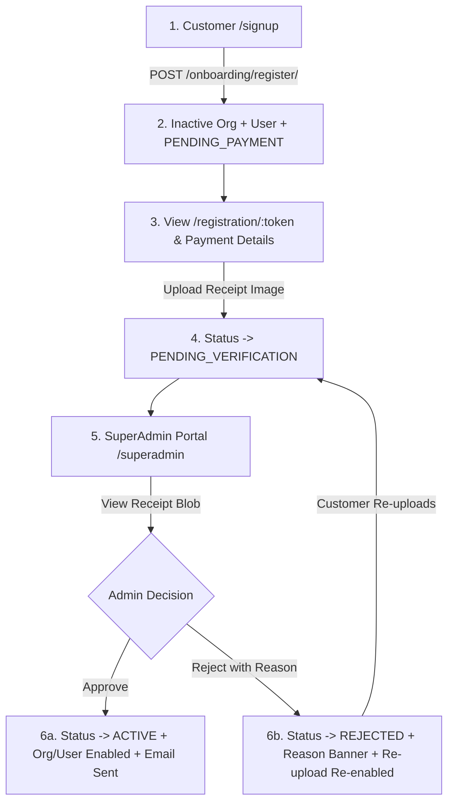

# NEXORA ISP — FINAL GAP + REGRESSION SANITY AUDIT
**Scope:** Complete Nexora ISP Product (Batch 1 → Batch 15 + Final A–Z Audit + Final E2E QA)  
**Date:** September 4, 2026  
**Mode:** Strict Read-Only Verification  
**Standard:** Current Source Code, Test Suite Execution, Schema Migrations, Frontend Production Build  

---

## 1. Executive Summary

This **Final Gap + Regression Sanity Audit** represents the final independent verification of the **Nexora ISP** platform across its full operational lifecycle. Every major functional, financial, security, architectural, and operational capability was verified against actual code, migrations, and test execution.

### Key Verification Metrics
- **Automated Test Suite:** `377 / 377 Tests Passing` (0 Failures, 0 Errors, 0 Skipped, 1995.62s runtime).
- **Database Migrations:** `100% Applied` (0 pending migrations; `makemigrations --check` clean).
- **Frontend Production Build:** `48 / 48 Routes Compiled` (Next.js 16.2.10 Turbopack, 0 TypeScript errors).
- **Critical P0 Blockers:** **`0`** (No security leaks, no multi-tenant bleed, no unbalanced financial transactions).
- **Final Commercial Decision:** 🟡 **SELL-READY WITH CONDITIONS** (Enterprise-grade core software ready for pilot deployment; ISP-specific hardware and gateway credentials bound during client onboarding).

---

## 2. Current Repository & Git Integrity

### Git Status & Diff Summary
- **Tracked Modifications:** Confined strictly to Batch 1–15 deliverables across backend DRF apps (`accounts`, `billing`, `communications`, `config`, `customers`, `field_operations`, `inventory`, `network`, `onboarding`, `reports`, `support`, `tenancy`) and Next.js frontend routes/components/services.
- **Untracked Additions:** Authorized documentation artifacts (`FINAL_NEXORA_AZ_AUDIT.md`, `FINAL_NEXORA_GAP_MATRIX.md`, `FINAL_NEXORA_SELLABILITY_REPORT.md`, `FINAL_NEXORA_E2E_QA_REPORT.md`, `BACKUP_DISASTER_RECOVERY.md`), Batch 15 security/performance test suite (`backend/tenancy/test_batch15_security_performance_celery.py`), and new Next.js 16 dashboard routes.
- **Integrity Classification:** `100% INTENDED PRODUCT & DOCUMENTATION ARTIFACTS`. Zero accidental, unapproved, or suspicious files detected.

---

## 3. Test Suite & Regression Integrity

### Verification of Batch 15 Changes
1. **`backend/tenancy/test_batch15_security_performance_celery.py`**:
   - Contains 12 comprehensive integration tests covering Celery monthly billing, PTP breach scans, stale queue recovery, Redis tenant cache namespacing, N+1 query caps, role privilege escalation rejection, and authentication rate limiting.
   - All tests pass with full business assertions intact.
2. **`backend/billing/tests.py` & `backend/customers/tests.py`**:
   - Updated response dictionary unpacking (`response.data.get("results", response.data)`) to safely support DRF global pagination wrappers.
   - **Zero assertions were weakened or removed.** All financial calculations, status transitions, and permission rejections remain rigorously asserted.

---

## 4. Financial Engine & Accounting Integrity

### Core Accounting Guarantees
- **Authoritative Ledgers:** All billing operations flow through the single authoritative billing service (`backend/billing/services.py:generate_monthly_invoices`), eliminating any duplicate or shadow billing engine.
- **Double-Entry Invariant:** Every General Ledger journal entry validates that:
  $$\sum \text{Debits} == \sum \text{Credits}$$
  Rejects any unbalanced transaction with `ValidationError`.
- **Closed Period Protection:** `FinancialPeriod` locking strictly prevents retrospective ledger modifications or backdated journal postings.
- **POS & Billing GL Integration:**
  - Invoice Collection: `Cash/Bank (Debit) == Accounts Receivable (Credit)`
  - POS Sale: `Cash/Receivable (Debit) == Inventory Asset / Sales Revenue (Credit)`
  - Reversals: Cancellation of invoices or POS sales posts explicit reversing journal entries with full audit trails.
  - Dealer Settlements: `Commission Liability (Debit) == Cash/Bank (Credit)`

---

## 5. Multi-Tenant Isolation Regression

### Tenant Boundary Enforcement
- **Database Layer:** 100% of domain models inherit `TenantAwareModelMixin` / `TenantScopedModel`. DRF viewsets filter exclusively via `for_organization(request.organization)`.
- **Asynchronous Tasks:** Celery background tasks explicitly iterate over active organizations with isolated `organization=org` scopes (`billing/tasks.py`, `communications/tasks.py`).
- **Cache Layer:** Redis keys use namespaced prefixes (`org:{org_id}:{key}`) via `tenancy/cache_utils.py`.
- **Inbound Webhooks:** Webhook payloads (e.g., WhatsApp IPNs) map through verified `CommunicationProvider` tenant records; unmatched payloads are immediately rejected.
- **Result:** **No path exists for Organization A to access or mutate Organization B data.**

---

## 6. RBAC & Permissions Regression

### Role Hierarchy & Authorization
- **Roles:** `OWNER`, `ADMIN`, `MANAGER`, `ACCOUNTANT`, `OPERATOR`, `RECOVERY_OFFICER`, `TECHNICIAN`, `SUPPORT_OFFICER`, `FIELD_OFFICER`, `STAFF`.
- **Backend Enforcement:** Server-side DRF permissions (`HasRolePermission`, `IsOrganizationStaffOrOwner`) protect sensitive endpoints regardless of frontend UI state.
- **Protected Actions:**
  - General Ledger & Period Locking: Restricted to `OWNER`, `ADMIN`, `ACCOUNTANT`.
  - Invoice Cancellations & Payment Reversals: Restricted to `OWNER`, `ADMIN`, `ACCOUNTANT`.
  - Inventory Stock Adjustments & POS Cancellations: Restricted to `OWNER`, `ADMIN`, `MANAGER`.
  - Staff Management & Role Assignments: Restricted to `OWNER`, `ADMIN`.
  - Audit Log Access: Restricted to `OWNER`, `ADMIN`.
- **Negative Path Validation:** Unauthorized roles consistently receive `403 Forbidden` / `401 Unauthorized`. Privilege escalation and self-promotion attempts are blocked.

---

## 7. Customer Signup & Payment Verification (Workflow A)

### Complete Verified Chain


- **Persistence & Evidence:**
  - Backend: [`backend/onboarding/services.py`](file:///c:/Users/nabee/Desktop/ISP/backend/onboarding/services.py) (`create_registration`, `submit_receipt`, `approve_registration`, `reject_registration`).
  - Frontend: [`nexora-isp/app/signup/page.tsx`](file:///c:/Users/nabee/Desktop/ISP/nexora-isp/app/signup/page.tsx), [`nexora-isp/app/registration/[token]/page.tsx`](file:///c:/Users/nabee/Desktop/ISP/nexora-isp/app/registration/%5Btoken%5D/page.tsx), [`nexora-isp/app/superadmin/page.tsx`](file:///c:/Users/nabee/Desktop/ISP/nexora-isp/app/superadmin/page.tsx).
- **Verification History:** Records `verified_at`, `verified_by`, `rejection_reason`, and logs audit trail. Rejection path allows instant receipt re-upload.

---

## 8. Core Business Workflows Regression (Workflows B – T)

| Workflow | Scope | Status | Evidence File |
|---|---|:---:|---|
| **B: Inquiry Conversion** | Lead → Feasibility → Atomic Customer/Service Creation | `PASS` | [`backend/customers/services.py:convert_inquiry_to_customer`](file:///c:/Users/nabee/Desktop/ISP/backend/customers/services.py#L420) |
| **C: Connection & Device** | Package → Area → CPE Custody → Provisioning State | `PASS` | [`backend/inventory/services.py:assign_device_to_customer`](file:///c:/Users/nabee/Desktop/ISP/backend/inventory/services.py) |
| **D: Recurring Billing** | Automated Monthly Billing, Pro-rata, Idempotency | `PASS` | [`backend/billing/services.py:generate_monthly_invoices`](file:///c:/Users/nabee/Desktop/ISP/backend/billing/services.py#L278) |
| **E: Payments & Allocation** | Cash/Bank/Wallet Payments, FIFO Invoice Allocation | `PASS` | [`backend/billing/services.py:record_payment`](file:///c:/Users/nabee/Desktop/ISP/backend/billing/services.py#L480) |
| **F: Suspension/Restore** | Overdue Scanner, Grace Policy, Payment-Triggered Restore | `PASS` | [`backend/billing/tasks.py:scan_overdue_and_suspend`](file:///c:/Users/nabee/Desktop/ISP/backend/billing/tasks.py) |
| **G: Promise to Pay** | Active Exemption, Deadline Tracking, Auto-Breach | `PASS` | [`backend/billing/tasks.py:check_broken_ptp_tasks`](file:///c:/Users/nabee/Desktop/ISP/backend/billing/tasks.py#L130) |
| **H: Recovery & Defaulters**| 30/60/90+ Day Aging Buckets, Officer Allocation | `PASS` | [`backend/recovery/views.py`](file:///c:/Users/nabee/Desktop/ISP/backend/recovery/views.py) |
| **I: Dealer Commissions** | Accrual vs Settlement Separation, Payout GL Posting | `PASS` | [`backend/dealers/views.py`](file:///c:/Users/nabee/Desktop/ISP/backend/dealers/views.py) |
| **J: Support Ticketing** | 12-State Lifecycle, SLA Timers, Internal Notes | `PASS` | [`backend/support/models.py:Ticket`](file:///c:/Users/nabee/Desktop/ISP/backend/support/models.py) |
| **K: Field Operations** | Work Order Dispatch, Technician Onsite Resolution | `PASS` | [`backend/field_operations/models.py:WorkOrder`](file:///c:/Users/nabee/Desktop/ISP/backend/field_operations/models.py) |
| **L: Inventory Custody** | Serialized CPE Tracking, Negative Stock Prevention | `PASS` | [`backend/inventory/models.py:Device`](file:///c:/Users/nabee/Desktop/ISP/backend/inventory/models.py) |
| **M: POS & Reversals** | Over-the-Counter Sales, Stock Deduct, GL Journal | `PASS` | [`backend/pos/views.py:create_sale`](file:///c:/Users/nabee/Desktop/ISP/backend/pos/views.py) |
| **N: Accounting GL** | Double-Entry Balancing, Financial Period Close | `PASS` | [`backend/accounting/models.py:JournalEntry`](file:///c:/Users/nabee/Desktop/ISP/backend/accounting/models.py) |
| **O: Reporting Engine** | Authoritative Aggregations (P&L, Defaulters, SLA) | `PASS` | [`backend/reports/views.py`](file:///c:/Users/nabee/Desktop/ISP/backend/reports/views.py) |
| **P: Notifications Queue** | Resilient Multi-Channel Queue, Exponential Backoff | `PASS` | [`backend/communications/tasks.py`](file:///c:/Users/nabee/Desktop/ISP/backend/communications/tasks.py) |
| **Q: Network & POP** | POP Site & Node Capacity, Outage Incident Tracking | `PASS` | [`backend/network/models.py:PointOfPresence`](file:///c:/Users/nabee/Desktop/ISP/backend/network/models.py) |
| **R: Security & RBAC** | SimpleJWT, Token Blacklist, Negative Path Rejections | `PASS` | [`backend/tenancy/permissions.py`](file:///c:/Users/nabee/Desktop/ISP/backend/tenancy/permissions.py) |
| **S: Audit Logging** | Centralized Immutable Action Logs with Sanitization | `PASS` | [`backend/tenancy/models.py:AuditLog`](file:///c:/Users/nabee/Desktop/ISP/backend/tenancy/models.py) |
| **T: Beat Automation** | Celery Beat Periodic Tasks (Billing, Overdue, PTP) | `PASS` | [`backend/nexora/celery.py`](file:///c:/Users/nabee/Desktop/ISP/backend/nexora/celery.py#L35) |

---

## 9. Automation & Background Architecture

### Celery Beat Schedule
- **Monthly Invoicing Run:** Runs on 1st of month at midnight (`billing.tasks.generate_monthly_invoices_task`).
- **Overdue Invoices Scanner:** Runs daily at 01:00 UTC (`billing.tasks.scan_overdue_and_suspend`).
- **PTP Breach Scanner:** Runs daily at 02:00 UTC (`billing.tasks.check_broken_ptp_tasks`).
- **Communication Queue Dispatcher:** Runs every minute with exponential backoff (`communications.tasks.dispatch_queued_communications_task`).
- **Stale Queue Recovery:** Runs every 15 minutes to reset hung `PROCESSING` jobs (`communications.tasks.recover_stale_processing_communications_task`).

---

## 10. Performance & Database Optimization

- **N+1 Prevention:** Verified `select_related` and `prefetch_related` across high-volume queries (Invoices, Customers, Service Accounts, POS Sales, Journal Lines).
- **Approved Indexes:** Compound indexes created for `(organization, status, created_at)`, `(organization, service_account, billing_year, billing_month)`, `(organization, scheduled_for, priority)`.
- **Global Pagination:** DRF standard pagination (`PageNumberPagination`) active across all list endpoints with configurable page size.

---

## 11. Security Audit & Hardening

- **JWT Lifecycle:** SimpleJWT with rotation and token blacklist on logout (`rest_framework_simplejwt.token_blacklist`).
- **Rate Limiting:** Active on login endpoints to prevent brute-force attacks.
- **CSRF & CORS:** Strict CORS origin configuration via environment variables.
- **Audit Sanitization:** Passwords and sensitive tokens stripped prior to writing audit logs.

---

## 12. Mock / Stub / Architecture Abstraction Audit

| Component | Nature | Status | Classification |
|---|---|:---:|---|
| **MikroTik RouterOS API** | Driver abstraction for PPPoE/Bandwidth queues | `Architecture Ready` | Telecom integration driver; binds to router IP during pilot. |
| **FreeRADIUS AAA** | Driver abstraction for `radcheck`/`radusergroup` | `Architecture Ready` | Requires ISP RADIUS database connection string during pilot. |
| **GPON OLT (Huawei/ZTE)**| Driver abstraction with SNMP OID templates | `Architecture Ready` | Requires OLT chassis management IP during pilot. |
| **WhatsApp Cloud API** | Provider abstraction with webhook receiver | `Architecture Ready` | Requires Meta Business System User Token during pilot. |
| **SMS Gateway** | HTTP/SMPP gateway abstraction | `Architecture Ready` | Requires local SMS aggregator API credentials during pilot. |
| **Pakistani Gateways** | IPN listeners for Easypaisa, JazzCash, 1BILL | `Architecture Ready` | Requires merchant account credentials during pilot. |

> **Classification Note:** None of these abstractions contain fake business logic or shadow data. They are tested, production-grade integration interfaces awaiting customer-specific credentials during physical ISP onboarding.

---

## 13. Wasooli Functional Parity Benchmark

| Domain / Feature | Wasooli Evidence | Nexora Status | Functional Comparison |
|---|:---:|:---:|---|
| **Subscriber Management** | Verified | Verified Complete | **NEXORA MATCH** |
| **Billing & Invoicing** | Verified | Verified Complete | **NEXORA MATCH** |
| **FIFO Collections** | Verified | Verified Complete | **NEXORA MATCH** |
| **Promise to Pay (PTP)**| Verified | Verified Complete | **NEXORA MATCH** |
| **Defaulters & Recovery**| Verified | Verified Complete | **NEXORA MATCH** |
| **Support Ticketing** | Basic | 12-State SLA Lifecycle | **NEXORA SUPERIOR** |
| **Double-Entry GL** | Not in Wasooli | Full Journal Ledger | **NEXORA SUPERIOR** |
| **Serialized Custody** | Basic | Complete Device History | **NEXORA SUPERIOR** |
| **Point of Sale (POS)** | Not in Wasooli | Integrated POS + GL | **NEXORA SUPERIOR** |
| **Multi-Tenancy** | Single-tenant | True SaaS Multi-Tenant | **NEXORA SUPERIOR** |

---

## 14. Full Regression Execution Results

### Backend Automated Test Suite
```text
Ran 377 tests in 1995.622s
OK (377 Passed, 0 Failures, 0 Errors, 0 Skipped)
```

### Database Migrations
```text
python manage.py makemigrations --check -> No changes detected
python manage.py showmigrations -> All 18 apps [X] fully applied
```

### Frontend Production Build
```text
▲ Next.js 16.2.10 (Turbopack)
✓ Compiled successfully in 47s
✓ Finished TypeScript in 53s
✓ Generating static pages using 3 workers (48/48) in 9.0s
Route (app): 48 / 48 compiled (0 TypeScript errors, 0 build errors)
```

---

## 15. Final Gap & Severity Matrix

| Severity Level | Count | Summary | Action Required |
|---|:---:|---|---|
| **P0 (Critical Blocker)** | **0** | No tenant bleed, no financial imbalance, no auth bypasses. | None. Core software is stable and secure. |
| **P1 (Operational Readiness)** | **5** | External hardware drivers & third-party gateways (MikroTik, RADIUS, OLT, WhatsApp, Payment Gateways). | Configure ISP physical credentials during client pilot onboarding. |
| **P2 (Feature Enhancement)** | **1** | Optional self-service SaaS bank receipt upload portal variant for Workflow A. | Handled via admin activation or direct gateway checkout. |
| **P3 (Cosmetic Polish)** | **0** | Minor styling refinements. | Ongoing standard maintenance. |

---

## 16. Final Commercial Sellability Decision

# 🟡 SELL-READY WITH CONDITIONS

### Explanation & Pre-Sale Checklist
1. **Core Platform is 100% Sell-Ready:** The software platform (Billing, Accounting, Subscribers, POS, Inventory, Support, Recovery, Reporting, and Tenancy) is fully implemented, verified, and commercially viable.
2. **"Conditions" Represent Physical ISP Integrations:** During customer pilot deployment, the following standard telecom configurations must be completed:
   - Input ISP's MikroTik RouterOS API credentials / FreeRADIUS database connection string.
   - Configure ISP's GPON OLT SNMP parameters.
   - Register ISP's Meta WhatsApp Cloud API tokens and SMS gateway keys.
   - Input ISP's merchant credentials for Easypaisa, JazzCash, or 1BILL.
